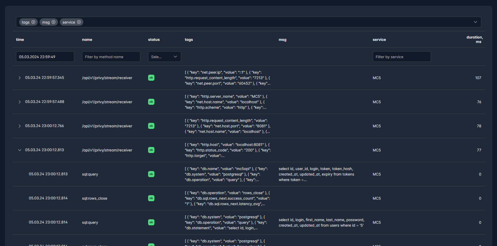
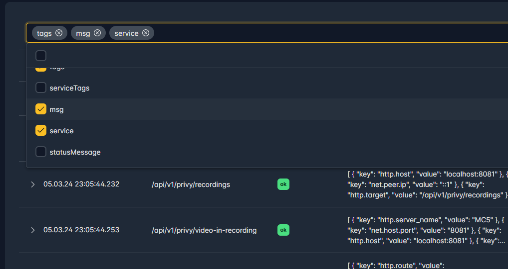
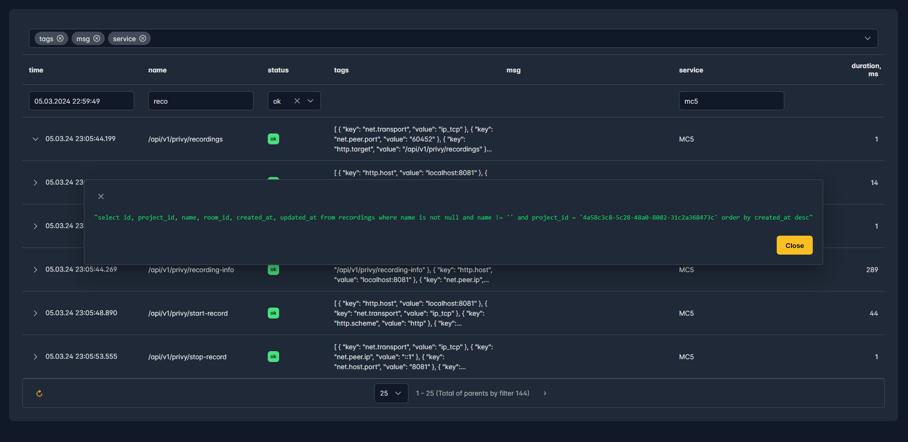
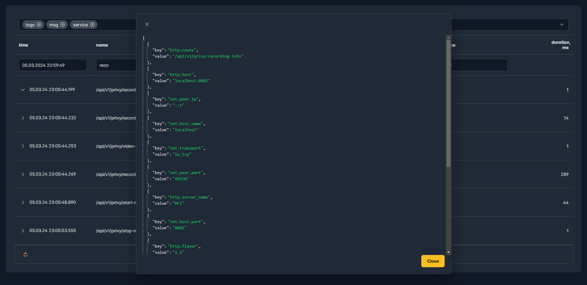

# Troubleshooting

Troubleshooting is an observability system designed to help you efficiently troubleshoot issues within your applications by logs and traces in one window. 
Check if your system make optimal sql-requests, maybe you want to find  excess backend calls. And sure, use it for local debugging your web-services

Stack info
------
* Storage: Clickhouse
* Tracer: opentelemetry
* Logger: zerolog (UI coming soon)
* Communication: gRPC for log and tracing sender, restAPI for UI-backend requests
* UI: vue3 + typescript
* Backend: golang

Some interesting specific
------
* Cursor navigation on UI betwwen pages
* Three days for store of data in storage. Old data erased by clickhouse mehanism

Status
------
Troubleshooting is currently at MVP stage. In progress: testing, updating documentation, improving build/deploy. If you're looking to hire someone to build an awesome troubleshooting/observability/monitoring system, ping me here.

Quick start
------
```
git clone https://github.com/agerimex/troubleshooting.git
cd troubleshooting
make all
docker-compose up
open url localhost:8095
```

How to intergate to your golang project
------
```
go get github.com/agerimex/troubleshooting/log-sender
go get github.com/riandyrn/otelchi
go get github.com/uptrace/opentelemetry-go-extra/otelsql
go get go.opentelemetry.io/otel/semconv/v1.20.0
```

* example for go-chi

```
package main
...
import (
...
    sender "github.com/agerimex/troubleshooting/log-sender"
...
)
...
func initOpenTelemetry() {
	flag.Set("addrTrace", "localhost:50055")
	_, err := sender.NewTracer("Test")
	if err != nil {
		fmt.Println("Where is receiver of traces")
	}
}
...
func main() {
...
    initOpenTelemetry()
... 
}
```

* routing
```
func (app *application) routers() http.Handler {
	mux := chi.NewRouter()
	mux.Use(middleware.Recoverer)
	mux.Use(otelchi.Middleware("LOG", otelchi.WithChiRoutes(mux)))
	mux.Use(cors.Handler(cors.Options{
		AllowedOrigins:   []string{"https://*", "http://*"},
		AllowedMethods:   []string{"GET", "POST", "PUT", "DELETE", "OPTIONS"},
		AllowedHeaders:   []string{"Accept", "Authorization", "Content-Type", "X-CSRF-Token"},
		ExposedHeaders:   []string{"Link"},
		AllowCredentials: true,
		MaxAge:           300,
	}))

	return mux
}
```

Coming soon
------
* UI for find zerolog by trace
* Search by sql (text and parameters)
* search by duration
* possible for set time interval
* e2e tests

## Open for feature requests, happy for helping with integration, and Welcome to connect for developing an awesome observability system

Screenshots
------

* Full page


* Possible for select a list of colums for view


* Details of SQL request with auto fill parameters


* Details for all http tags for request

