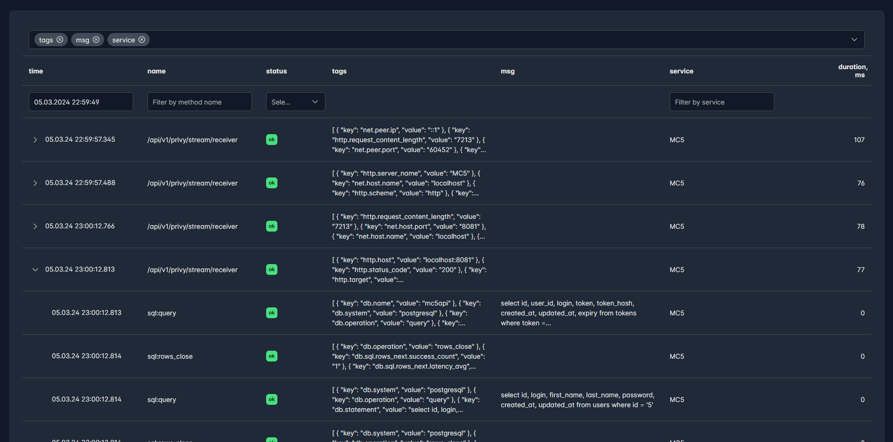
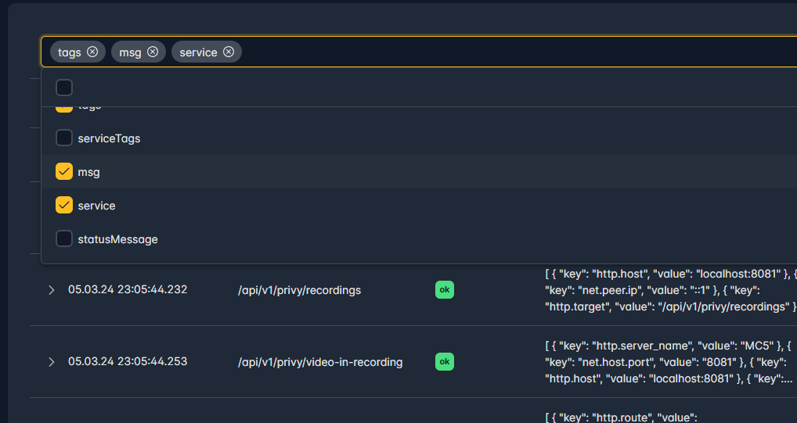
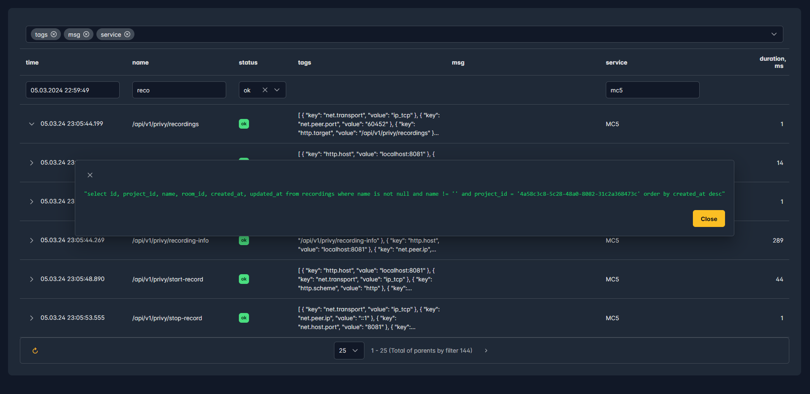
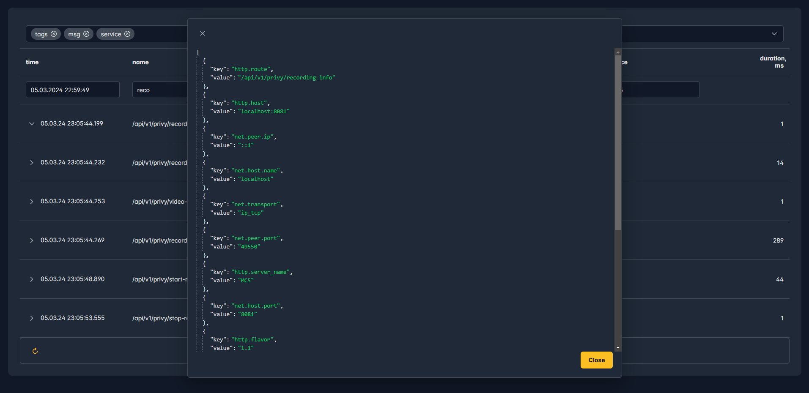

# Troubleshooting

Troubleshooting is an observability system designed to help you efficiently troubleshoot issues within your applications by logs and traces in one window. 
Check if your system make optimal sql-requests, maybe you want to find  excess backend calls. And sure, use it for local debugging your web-services

Stack info
------
* Storage: Clickhouse
* Tracer: opentelemetry
* Logger: zerolog (UI coming soon)
* Communication: gRPC for log and tracing sender, restAPI for UI-backend requests
* UI: vue3 + typescript
* Backend: golang

Some interesting specific
------
* Cursor navigation on UI betwwen pages
* Three days for store of data in storage. Old data erased by clickhouse mehanism

Status
------
Troubleshooting is currently at MVP stage. In progress: testing, updating documentation, improving build/deploy. If you're looking to hire someone to build an awesome troubleshooting/observability/monitoring system, ping me here.

Quick start
------
```
git clone https://github.com/agerimex/troubleshooting.git
cd troubleshooting
make all
docker-compose up
open url localhost:8095
```

How to intergate to your golang project
------
```
go get github.com/agerimex/troubleshooting/log-sender
go get github.com/riandyrn/otelchi
go get github.com/uptrace/opentelemetry-go-extra/otelsql
go get go.opentelemetry.io/otel/semconv/v1.20.0
```

* example for go-chi

```
package main
...
import (
...
    sender "github.com/agerimex/troubleshooting/log-sender"
...
)
...
func initOpenTelemetry() {
	_, err := sender.NewTracer("Test",
		sender.WithAddress("localhost:50055"),
		// sender.WithToken("..."), // or TROUBLESHOOTING_TOKEN env, if the receiver requires a token
	)
	if err != nil {
		fmt.Println("Where is receiver of traces")
	}
}
...
func main() {
...
    initOpenTelemetry()
    defer sender.Shutdown(context.Background()) // flushes spans still in the buffer
... 
}
```

If the receiver is unavailable, spans are dropped and the error is logged through OpenTelemetry; your application keeps running. (`flag.Set("addrTrace", ...)` from older versions still works.)

* routing
```
func (app *application) routers() http.Handler {
	mux := chi.NewRouter()
	mux.Use(middleware.Recoverer)
	mux.Use(otelchi.Middleware("LOG", otelchi.WithChiRoutes(mux)))
	mux.Use(cors.Handler(cors.Options{
		AllowedOrigins:   []string{"https://*", "http://*"},
		AllowedMethods:   []string{"GET", "POST", "PUT", "DELETE", "OPTIONS"},
		AllowedHeaders:   []string{"Accept", "Authorization", "Content-Type", "X-CSRF-Token"},
		ExposedHeaders:   []string{"Link"},
		AllowCredentials: true,
		MaxAge:           300,
	}))

	return mux
}
```

Send traces from any language (OTLP)
------
The receiver also accepts the standard OpenTelemetry protocol (OTLP over gRPC) on port 4317, so any application instrumented with an OpenTelemetry SDK (Go, Java, Python, Node.js, .NET, …) or an OpenTelemetry Collector can send traces without log-sender. Usually environment variables are enough:

```
OTEL_EXPORTER_OTLP_ENDPOINT=http://localhost:4317
OTEL_EXPORTER_OTLP_PROTOCOL=grpc
OTEL_SERVICE_NAME=orders-api
# if the receiver requires a token:
OTEL_EXPORTER_OTLP_HEADERS="authorization=Bearer <token>"
```

Only traces over gRPC are supported for now (not OTLP/HTTP on port 4318, not logs or metrics). Some SDKs, e.g. Node.js, default to HTTP, so set the protocol explicitly.

Configuration
------
All settings are environment variables; docker-compose reads them from the shell or a `.env` file next to `docker-compose.yml`. Everything works without them.

| Variable | Used by | Default |
| --- | --- | --- |
| `CLICKHOUSE_ADDR` | receiver, analysis | `clickhouse-server:9000` (`localhost:19000` when running a service outside Docker) |
| `CLICKHOUSE_DATABASE`, `CLICKHOUSE_USER`, `CLICKHOUSE_PASSWORD` | ClickHouse, receiver, analysis | `default`, `default`, empty |
| `LISTEN_ADDR` | receiver, analysis | `:50055`, `:8094` |
| `OTLP_LISTEN_ADDR` | receiver (OTLP/gRPC) | `:4317` |
| `TRACE_RECEIVER_ADDR` | analysis (its own traces) | `log-receiver-compose:50055` |
| `CORS_ALLOWED_ORIGINS` | analysis | `http://localhost:5173,http://127.0.0.1:5173` (Vite dev server) |
| `APP_ENV` | analysis | empty; `development` pretty-prints JSON |
| `TROUBLESHOOTING_TOKEN` | receiver (both ports), log-sender | empty = no token check |
| `UI_AUTH`, `UI_USER`, `UI_PASSWORD_HASH` | UI (Caddy) | `off` |

Security
------
By default there is no authentication, which is convenient for local debugging. ClickHouse and the API port are published on `127.0.0.1` only; the UI (8095) and the receiver (50055, 4317) are reachable from the network. On a shared server, turn on:

* Basic auth for the UI and API: `UI_AUTH=basic`, `UI_USER=<name>`, `UI_PASSWORD_HASH=<hash>` where the hash comes from `docker run --rm caddy:2 caddy hash-password --plaintext '<password>'`. In `.env`, wrap the hash in single quotes because it contains `$`.
* A shared token for the receiver: `TROUBLESHOOTING_TOKEN=<random string>` for the receiver and every application that sends traces. The token travels unencrypted (no TLS), so it keeps out stray senders, not someone who can watch the network.
* A password for ClickHouse: `CLICKHOUSE_PASSWORD`.

Coming soon
------
* UI for find zerolog by trace
* Search by sql (text and parameters)
* search by duration
* possible for set time interval
* e2e tests

## Open for feature requests, happy for helping with integration, and Welcome to connect for developing an awesome observability system

Screenshots
------

* Full page


* Possible for select a list of colums for view


* Details of SQL request with auto fill parameters


* Details for all http tags for request

